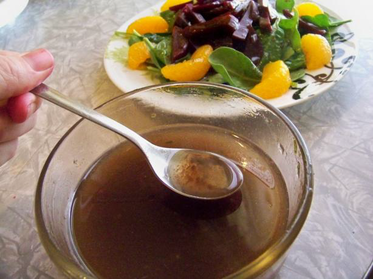

# French Vinaigrette

*The most basic and balanced vinaigrette, this French classic relies on the ancient 1:3 ratio of vinegar to oil with mustard as the emulsifier. This is the foundation upon which all vinaigrettes are built, perfect for simple greens.*

**Yield:** Approximately 100 milliliters (4-6 servings)

## Overview
French vinaigrette is the fundamental dressing in classical cuisine, a simple emulsion of vinegar, oil, and mustard in perfect balance. The ratio is essential: one part vinegar to three parts oil creates brightness without overwhelming acidity. Dijon mustard serves double duty as emulsifier and flavor agent. This is not a dressing meant for long storage; it's best made fresh, though it keeps refrigerated for several days.

## Ingredients

### Base Components
- 1 teaspoon Dijon mustard (French style)
- 1 tablespoon red wine vinegar (or white wine vinegar)
- 3 tablespoons neutral oil (groundnut oil traditional; sunflower acceptable)
- 1/4 teaspoon fine sea salt
- Pinch of freshly ground black pepper

## Method

### Stage 1 – Combine Mustard & Acid
1. Pour 1 tablespoon red wine vinegar into a small bowl.
1. Add 1 teaspoon Dijon mustard, salt, and pepper.
1. Whisk vigorously for 1-2 minutes until mustard fully incorporates.

### Stage 2 – Emulsify with Oil
1. While whisking continuously, add 3 tablespoons oil in a very slow, steady stream, just drops at first.
1. As the oil incorporates, whisk constantly to emulsify.
1. Once you've added about 1 tablespoon oil, you can add remaining oil in a slightly faster stream while whisking.
1. Continue whisking until all oil is incorporated and vinaigrette is homogeneous.

### Stage 3 – Taste & Adjust
1. Taste on a piece of bread or salad leaf.
1. Adjust balance: too acidic? Add 1/2 tablespoon more oil. Too oily? Add 1 teaspoon more vinegar.
1. Add salt or pepper as needed.

## Notes
- **The 1:3 Ratio Essential:** This classical ratio creates perfect balance between acid and fat.
- **Mustard as Emulsifier:** Natural lecithin in mustard binds oil and vinegar; without it, they separate.
- **Whisking Technique:** Vigorous whisking creates and maintains the emulsion, essential for success.
- **Oil Type Matters:** Neutral oils let vinegar shine; extra virgin creates different character.
- **Vinegar Choice Changes Character:** Red wine is robust; white wine is lighter; rice wine creates Asian character.
- **Fresh is Best:** Best served immediately; keeps refrigerated 3-4 days. Whisk again before serving as emulsion separates naturally.
- **Temperature Sensitive:** Room temperature ingredients emulsify better than cold items.

## Variations
**Red Wine Vinaigrette:** Use red wine vinegar exclusively (as above).
**White Wine Vinaigrette:** Substitute white wine vinegar; omit mustard for lighter character.
**Shallot Vinaigrette:** Add 1 finely minced shallot; let sit 10 minutes for flavor development.
**Whole Grain Mustard:** Replace Dijon with coarse mustard for more texture.
**With Tarragon:** Add 1 teaspoon fresh tarragon for herbaceous character.

## Serving
Use with: Simple green salads, bitter lettuces, warm vegetables, roasted potatoes, grilled fish, cold meats
Dressing ratio: 1-2 tablespoons per serving of greens
Temperature: Room temperature
Timing: Apply just before serving

## Storage
- Refrigerate in sealed glass jar for up to 4-5 days
- Emulsion will naturally separate; whisk vigorously 1-2 minutes to re-emulsify
- Can be made 1-2 hours ahead if kept at room temperature
- Does not freeze well
- Best served fresh; flavor clarity decreases after 2-3 days