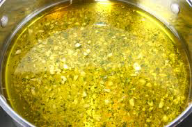

# Lemon and Mint Vinaigrette

*This light, herbaceous vinaigrette balances bright lemon with cool mint. Simple and elegant, it's perfect with watercress and delicate spring greens.*

**Yield:** Approximately 100 milliliters (4-6 servings)

## Overview
This vinaigrette skips traditional vinegar in favor of fresh lemon juice paired with mint. The result is exceptionally light and fresh, perfect for delicate greens. Minimal cooking at its finest; just whisk together quality ingredients. Mint leaves are scattered on top just before serving, preserving fresh aromatics.

## Ingredients

### Base
- 2 lemons (zest and juice)
- 6 tablespoons groundnut oil
- 6 fresh mint leaves (snipped just before use)
- Fine sea salt and freshly ground black pepper (to taste)

## Method

### Stage 1 – Prepare Lemon
1. Wash lemons and zest using microplane.
1. Squeeze lemons; aim for 3-4 tablespoons fresh juice.
1. Measure about 1 tablespoon lemon zest.

### Stage 2 – Combine Base
1. Pour lemon juice into small bowl.
1. Add 1 tablespoon lemon zest, pinch of salt, and pinch of pepper.
1. Whisk vigorously for 1 minute.

### Stage 3 – Add Oil
1. While whisking continuously, add 6 tablespoons groundnut oil in slow stream.
1. Whisk until all oil is incorporated and vinaigrette emulsifies.

### Stage 4 – Taste & Adjust
1. Taste on a piece of salad green.
1. Adjust salt, pepper, or add additional lemon juice as needed.

### Stage 5 – Add Mint
1. Snip 6 fresh mint leaves with scissors just before serving.
1. Scatter over top of vinaigrette just before dressing salad.
1. Do not whisk in; keep leaves visible.

## Notes
- **Fresh Mint Essential:** Dried mint has no character; use only fresh.
- **Mint Timing:** Add just before serving, whisking damages delicate leaves.
- **Lemon Juice Quality:** Fresh juice is non-negotiable; bottled lacks complexity.
- **Light Dressing:** Use less than traditional (1-2 tablespoons per serving).
- **Zest for Brightness:** Adds visible citrus character and oils that deepen flavor.
- **Delicate Greens Only:** Will be overwhelmed on hearty lettuces.

## Variations
**With Lime:** Replace lemon with lime.
**Extra Herbaceous:** Add 1/2 teaspoon fresh basil or tarragon.
**With Shallot:** Add 1 finely minced shallot for depth.
**Extra Lemon:** Increase juice to 4-5 tablespoons.
**With Honey:** Add 1/4 teaspoon honey to balance acidity.

## Serving
Use with: Watercress, spring greens, delicate lettuces, baby spinach, tender arugula
Dressing ratio: 1-2 tablespoons per serving
Temperature: Room temperature
Timing: Dress just before serving

## Storage
- Refrigerate in sealed glass jar for up to 2-3 days
- Mint will fade and darken; discard if stored separately
- Without mint, base keeps 3-4 days
- Add fresh mint just before serving
- Do not freeze; citrus oils degrade
- Best consumed fresh