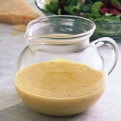

# Parmesan Vinaigrette

*This creamy, pungent vinaigrette combines Champagne vinegar's delicate acidity with double cream richness, Parmesan's nutty depth, and sharp mustard powder. It pairs beautifully with raw chicory, tender spinach, or sliced mushrooms.*

**Yield:** Approximately 150 milliliters (6 servings)

## Overview
Parmesan vinaigrette demonstrates how cream elevates a simple dressing from vinaigrette to something more luxurious. The combination of Champagne vinegar (lighter than wine vinegars), English mustard powder (more assertive than Dijon), fresh Parmesan, and heavy cream creates a dressing with depth and richness. This is perfect for winter salads with sturdy greens that can handle its personality.

## Ingredients

### Base
- 1 teaspoon English mustard powder
- 2 tablespoons Champagne wine vinegar
- 1/4 teaspoon fine sea salt
- Pinch of freshly ground black pepper

### Cream & Cheese
- 6 tablespoons heavy double cream (cold)
- 30 grams Parmesan cheese (finely grated, Parmigiano-Reggiano preferred)
- 1 tablespoon fresh chives (snipped finely)

### Optional
- 1-2 tablespoons warm water (to thin if needed)

## Method

### Stage 1 – Combine Mustard & Vinegar
1. Place 1 teaspoon English mustard powder in a small bowl.
1. Add 2 tablespoons Champagne wine vinegar.
1. Whisk vigorously for 1-2 minutes until mustard fully dissolves and the mixture becomes smooth.
1. Add 1/4 teaspoon fine sea salt and pinch of pepper; whisk again.

### Stage 2 – Add Parmesan
1. Add 30 grams finely grated Parmesan cheese to the vinegar-mustard mixture.
1. Whisk thoroughly for 1 minute until cheese fully incorporates.
1. The mixture will smell assertively of Parmesan and mustard.

### Stage 3 – Incorporate Cream
1. Add 6 tablespoons cold heavy double cream to the mixture.
1. Whisk vigorously until all cream is incorporated and the vinaigrette becomes creamy and smooth.
1. The cold cream will partially emulsify with the acidic vinegar mixture.
1. Do not over-whisk; you want a creamy consistency, not aerated foam.

### Stage 4 – Add Chives & Adjust Consistency
1. Snip 1 tablespoon fresh chives finely with scissors.
1. Fold chives gently into the vinaigrette.
1. If the dressing seems too thick, whisk in 1-2 tablespoons warm water to reach desired pourable consistency.
1. Taste and adjust seasoning (salt, pepper, or additional mustard if needed).

## Notes
- **English Mustard Powder Essential:** This is more pungent than Dijon; it's the correct choice for this dressing.
- **Champagne Vinegar Delicate:** Using wine vinegar or rice vinegar changes the character; Champagne vinegar's subtle acidity is important.
- **Parmesan Freshness:** Use freshly grated Parmigiano-Reggiano; pre-grated powder lacks character.
- **Cold Cream Important:** Cold cream emulsifies better than room temperature; this creates better texture.
- **Chives Fresh:** Dried chives have no character; use only fresh.
- **Cream Separated is Normal:** This dressing may separate slightly when refrigerated; whisk gently before serving.

## Variations
**Roasted Garlic:** Add 1/2 teaspoon roasted garlic puree for additional depth.
**With Truffle Oil:** Add 1/2 teaspoon truffle oil for luxury.
**Extra Tangy:** Increase mustard powder to 1.5 teaspoons for more assertive character.
**Less Creamy:** Reduce cream to 4 tablespoons for lighter consistency.
**With Shallot:** Add 1 finely minced shallot for aromatic complexity.

## Serving
Use with: Raw chicory, tender spinach, sliced mushrooms, bitter winter greens, warm cooked vegetables
Dressing ratio: 2-3 tablespoons per serving
Temperature: Room temperature
Timing: Dress just before serving

## Storage
- Refrigerate in sealed glass jar for up to 3 days
- Cream content means limited shelf-life; use within 2-3 days
- Emulsion will separate slightly; whisk gently before serving
- Do not freeze; cream breaks upon thawing
- Best consumed fresh for maximum flavor and texture