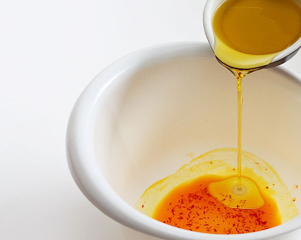

# Saffron Vinaigrette

*This luxurious, golden dressing infuses white wine vinegar with costly saffron threads, then incorporates both groundnut and sesame oils. Designed for elegant presentations with tender leaves and seafood garnishes like scallops or langoustine.*

**Yield:** Approximately 150 milliliters (6 servings)

## Overview
Saffron vinaigrette represents refinement and luxury, both in ingredient cost and in application. Saffron's distinctive golden color and complex floral-earthy flavor contribute to a dressing of considerable sophistication. The infusion of saffron in warm vinegar extracts maximum flavor while creating a visually stunning golden liquid. Combined with two different oils (groundnut for body, sesame for aromatics) and brightened with soy sauce, this dressing is designed specifically for elegant presentations where appearance and subtle flavor matter greatly.

## Ingredients

### Vinegar Base
- 3 tablespoons white wine vinegar
- 1 small pinch saffron threads (approximately 15-20 threads)

### Oils
- 6 tablespoons groundnut oil (or neutral oil)
- 1 tablespoon sesame oil (toasted Asian style)

### Seasonings
- 1 teaspoon soy sauce
- 1/4 teaspoon fine sea salt
- Pinch of cayenne pepper (to taste)

## Method

### Stage 1 – Infuse Saffron
1. Pour 3 tablespoons white wine vinegar into a small saucepan.
1. Set over medium-low heat and warm gently until steaming but not boiling (approximately 40-50°C).
1. Add 1 small pinch saffron threads (approximately 15-20 threads).
1. Remove from heat immediately.
1. Cover the pan loosely with a cloth or small plate.
1. Allow to cool completely to room temperature, this infusion takes 20-30 minutes.
1. As it cools, the saffron will release its golden color and distinctive flavor into the vinegar.

### Stage 2 – Prepare Oil Mixture
1. While the saffron infuses, measure 6 tablespoons groundnut oil and 1 tablespoon sesame oil into a small bowl.
1. Whisk briefly to combine the two oils.
1. Set aside.

### Stage 3 – Combine Vinegar with Oils
1. Once the saffron vinegar has cooled completely, pour it into a clean bowl.
1. While whisking constantly, add the oil mixture very slowly, initially just a few drops.
1. As the oils begin to incorporate, whisk vigorously to emulsify.
1. Continue adding oils in a slow, steady stream while whisking.
1. Once you've added about half the oil and the mixture begins to emulsify, you can add remaining oil in a slightly faster stream while still whisking.
1. Continue until all oils are incorporated.

### Stage 4 – Add Seasonings
1. Add 1 teaspoon soy sauce; whisk to combine.
1. Add 1/4 teaspoon fine sea salt; whisk to combine.
1. Add a pinch of cayenne pepper; whisk once more.
1. Taste on a piece of tender leaf or delicate vegetable.
1. Adjust seasoning as needed; the soy sauce provides umami, the cayenne adds a subtle heat suggestion.

## Notes
- **Saffron Quality & Cost:** Premium saffron threads are expensive but essential for flavor and color. Avoid powdered saffron.
- **Infusion Temperature:** Warm the vinegar gently but don't boil; high heat damages saffron's delicate flavor compounds.
- **Saffron Patience:** The full flavor develops as the infusion cools; don't rush this step.
- **Sesame Oil Aromatic:** This strong oil should be used sparingly; too much overwhelms the delicate saffron.
- **Emulsification:** The saffron vinegar's acidity level may make complete emulsification difficult; some separation is acceptable.
- **Visual Drama:** The golden color is part of the appeal; this dressing is meant for elegant plating.
- **Delicate Greens Only:** This is not a dressing for hearty salads; save it for tender leaves with special presentations.

## Variations
**Without Soy:** Omit soy sauce for pure saffron character (though umami is lost).
**Extra Sesame:** Increase sesame oil to 1.5 tablespoons for more aromatic emphasis.
**Milder Heat:** Reduce or omit cayenne; the saffron's heat profile should dominate.
**With Lemongrass:** Add 1/2 teaspoon finely minced lemongrass for Asian character.
**Higher Quality Saffron:** Using Persian or Kashmiri saffron elevates the dressing further (though cost increases).

## Serving
Use with: Tender salad leaves, special-occasion presentations, alongside grilled scallops or langoustine, light fish preparations, delicate vegetables
Dressing ratio: 1-2 tablespoons per serving (this is rich and assertive)
Temperature: Room temperature
Presentation: The golden color should be visible; reserve for elegant plating

## Storage
- Refrigerate in sealed glass jar for up to 3-4 days
- The saffron will continue to deepen in color and intensity over 1-2 days
- Emulsion may separate slightly; whisk gently before serving
- Do not freeze; oils degrade and saffron character dissipates
- Best consumed within 1-2 days for maximum saffron freshness
- Store in cool, dark place to preserve saffron's color