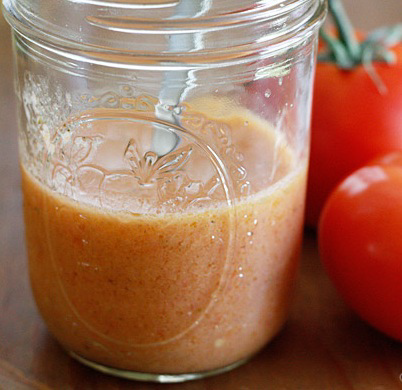

# Tomato Vinaigrette

*This bright, summer-forward dressing is made from fresh tomato juice balanced with sherry vinegar and enriched with delicate olive oil. Its fresh basil finish and subtle heat make it ideal for pasta salads, warm vegetable preparations, and tomato-forward dishes.*

**Yield:** Approximately 200 milliliters (6 servings)

## Overview
Tomato vinaigrette is quintessentially simple: ripe tomatoes become juice, which balances against warm sherry vinegar and fruity olive oil. This is among the lightest vinaigrettes because it relies on tomato juice (not cream or cheese) as its primary component. The acid and oil exist in lighter proportion than classical vinaigrettes, making this ideal for warm vegetable preparations and pasta salads where you want maximum tomato character. Fresh basil at the end provides essential aromatic lift; the cayenne adds just enough heat to complement tomato's natural sweetness.

## Ingredients

### Tomato Base
- 150 milliliters fresh tomato juice (pressed from ripe tomatoes)

### Oils & Acid
- 50 milliliters extra virgin olive oil
- 50 milliliters sherry vinegar

### Seasonings & Finish
- 5 grams fresh basil leaves (approximately 1 tablespoon, snipped)
- Salt to taste
- Pinch of cayenne pepper to taste

## Method

### Stage 1 – Prepare Fresh Tomato Juice
1. Select 3-4 medium, ripe, flavorful tomatoes (approximately 500-600 grams total).
1. Core each tomato and cut into quarters.
1. Place tomatoes in a food processor and pulse until completely liquefied.
1. Pour the tomato liquid through a fine-mesh strainer.
1. Press gently to extract all juice; you should yield approximately 150 milliliters.
1. Allow the juice to come to room temperature before proceeding.

### Stage 2 – Combine Vinegar & Juice
1. Pour 150 milliliters fresh tomato juice into a clean bowl.
1. Add 50 milliliters sherry vinegar.
1. Whisk together very gently (do not create foam or vigorous emulsion).
1. The mixture should smell bright, acidic, and decidedly tomato-forward.

### Stage 3 – Incorporate Olive Oil
1. While whisking gently and constantly, begin adding the olive oil very slowly.
1. Start with small amounts (approximately 1 tablespoon at a time).
1. Mix very gently; this is not a vigorous emulsification.
1. Continue adding oil in slow streams while whisking gently.
1. The mixture will remain somewhat loose and fluid; this is correct.
1. Complete emulsification is not the goal; the oils and tomato juice should remain somewhat discrete.

### Stage 4 – Season & Finish
1. Add salt to taste; begin conservatively with 1/4 teaspoon and adjust.
1. Add a pinch of cayenne pepper; adjust to taste (the cayenne balances tomato's natural sweetness).
1. Just before serving, add 5 grams fresh basil leaves (finely snipped).
1. Whisk once more and serve immediately.

## Notes
- **Fresh Tomato Juice Essential:** Bottled or canned tomato juice creates a heavy, processed result; fresh juice is non-negotiable.
- **Ripeness Critical:** Underripe tomatoes yield thin, acidic juice with no sweetness; select fully ripe, flavorful varieties.
- **Gentle Mixing:** Unlike classical vinaigrettes, this is mixed very gently without vigorous whisking; separation is normal and expected.
- **Basil Timing:** Add basil immediately before serving; it discolors and wilts quickly when in contact with acids.
- **Separation Expected:** This dressing will separate more readily than cream-based or oil-vinegar classical vinaigrettes. This is normal.
- **Cayenne Balance:** The cayenne's role is subtle, to balance tomato's natural sweetness, not to provide heat.

## Variations
**Without Garlic:** Use pure tomato juice for maximum tomato focus (no aromatic competition).
**With Balsamic:** Replace 25 milliliters sherry vinegar with 25 milliliters aged balsamic for sweeter, more complex character.
**Extra Basil:** Increase basil to 2 tablespoons and add fresh oregano (1/2 teaspoon) for herbal complexity.
**Spicier Version:** Increase cayenne to 1/2 teaspoon for moderate heat.
**With Fresh Thyme:** Add 1/2 teaspoon fresh thyme leaves alongside basil for herbal depth.

## Serving
Use with: Fresh pasta salads (dress immediately before serving), warm vegetable preparations, sliced tomatoes with fresh mozzarella, white bean salads, rice salads, grilled vegetable platters
Dressing ratio: 2-3 tablespoons per serving (the juice base is light and delicate)
Temperature: Room temperature or slightly cool
Application: Dress salads or vegetables immediately before serving; this dressing becomes heavy if it sits on greens

## Storage
- The fresh tomato juice can be prepared up to 1 day ahead and refrigerated in a sealed container.
- Complete dressing (vinegar, oil, and juice combined) keeps refrigerated for 2-3 days but develops flat flavor after 24 hours.
- Basil must be added immediately before serving (it discolors and wilts within 30 minutes).
- Separation is normal and expected; whisk or shake gently before each use.
- Do not freeze; tomato juice becomes watery and oil properties degrade.
- Best consumed within 1 hour of final preparation for maximum freshness and aromatic basil character.